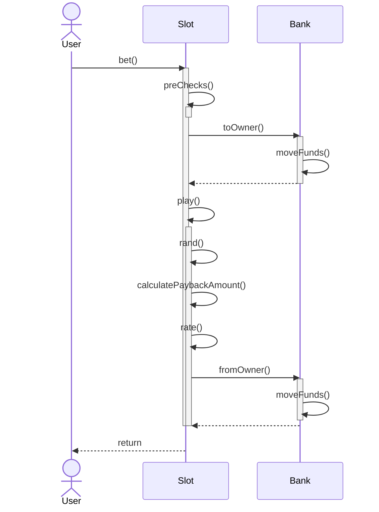

```mermaid

sequenceDiagram
    actor User
    participant Slot
    participant Bank
    User->>Slot: bet()
    activate Slot
    Slot->>Slot: preChecks()
    activate Slot
    deactivate Slot
    Slot->>Bank: toOwner()
    activate Bank
    Bank->>Bank : moveFunds()
    Bank-->>Slot: 
    deactivate Bank
    Slot->>Slot: play()
    activate Slot
    Slot->>Slot: rand()
    Slot->>Slot: calculatePaybackAmount()
    Slot->>Slot: rate()
    Slot->>Bank: fromOwner()
    activate Bank
    Bank->>Bank : moveFunds()
    deactivate Bank
    Bank-->>Slot: 
    deactivate Slot
    deactivate Slot
    Slot-->>User:return
```