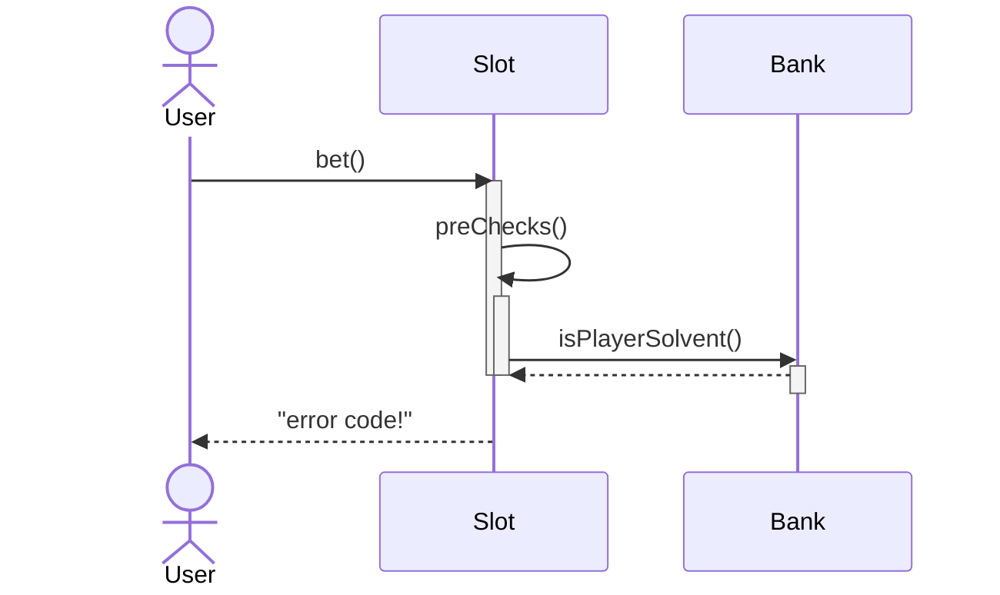

```mermaid

sequenceDiagram
    actor User
    participant Slot
    participant Bank
    User->>Slot: bet()
    activate Slot
    Slot->>Slot: preChecks()
    activate Slot
    Slot->>Bank:isPlayerSolvent()
    activate Bank
    Bank-->>Slot: 
    deactivate Bank
    deactivate Slot
    deactivate Slot
    Slot-->>User:"error code!"
```