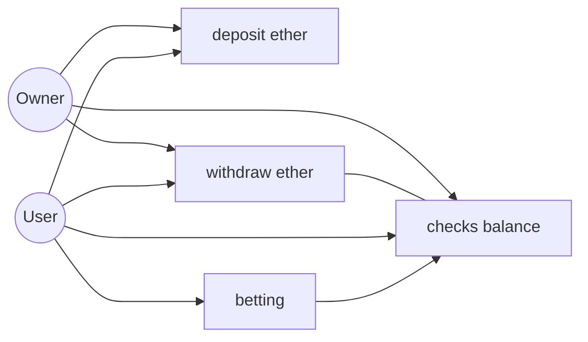

# Use cases

## List

- Owner deposits ether
- Owner withdraws ether
- User checks his balance
- User deposits ether
- User withdraws ether
- User bets on a game

```mermaid
graph LR
A((User))
B((Owner))
C[checks balance]
D[deposit ether]
E[withdraw ether]
F[betting]

A ---> D
F --> C
A --> C

E --- C

A ---> E
B ---> C
B ---> D
B ---> E
A --> F

```
